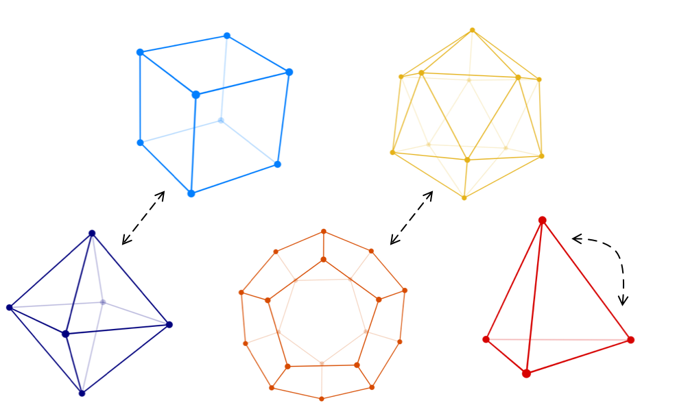

# Symmetries

This playground book gives a quick insight into the symmetry groups of 3-dimensional objects like the platonic solids.
The user can play around with the platonic solids (which are rendered by a custom-written renderer). Additionally, they can experience the rotational symmetries of select solids. The icing on the cake is the duality operation - users can interactively see the generation of *dual* platonic solids. 

This playground was created within one week (7 days) for Apple's WWDC 2020 Swift Student Challenge. To run this playground you need the [Swift Playgrounds](https://www.apple.com/swift/playgrounds/) app (either for macOS or iPadOS). For best experience, use a device with a large screen.

## Impressions

